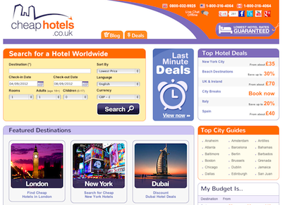
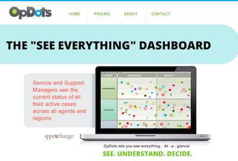

# Gallery

The websites and apps below use Agility.js in production. If you would like to add your startup/site here, [let us know!](http://twitter.com/agilityjs)

## [cheaphotels.co.uk](http://cheaphotels.co.uk)

Cheap Hotels is an online search engine and deal finder for hotels across the globe.

## [OpDots.com](http://opdots.com)

OpDots is the "see everything" dashboard for your enterprise data.

## [The Wall](http://thewall.agilityjs.com)

The Wall is a minimal Twitter clone, where everyone can post anonymously to a virtual "wall". It illustrates most features offered by Agility, including server-side persistence.

